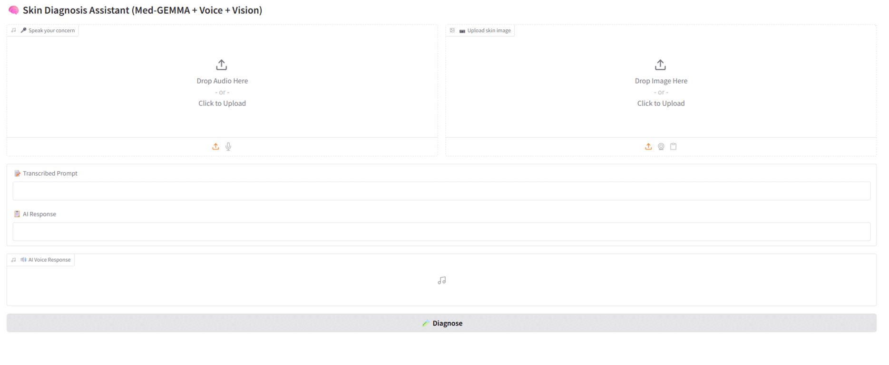

# Skin Diagnosis Assistant using Med-GEMMA, Whisper, and Gradio



## Overview

This project presents a multimodal AI system for dermatological diagnosis, integrating state-of-the-art vision-language modeling with speech-based user interaction. The system leverages **Med-GEMMA** — a large-scale medical vision-language foundation model developed by Google DeepMind — to analyze skin images alongside user-provided voice prompts and deliver clinically relevant textual and spoken reports.

The user interface is implemented using [Gradio](https://gradio.app/), allowing intuitive upload of skin images and voice queries, followed by AI-generated diagnostic feedback in both text and synthesized speech formats. This design aims to enhance accessibility and interactivity for clinical decision support in dermatology.

## Key Components

- **Med-GEMMA** ([Gao et al., 2023](https://arxiv.org/abs/2304.13824)): A generalist vision-language model pre-trained on diverse medical data enabling zero-shot and few-shot reasoning across multiple imaging modalities.
- **Whisper** ([Radford et al., 2022](https://openai.com/research/whisper)): An automatic speech recognition (ASR) system for accurate transcription of user voice input.
- **gTTS**: Google's Text-to-Speech API for converting AI-generated text responses into natural-sounding speech.
- **Gradio**: Provides an accessible web-based interface for multimodal input and output interaction.

## Features

- Multimodal input: simultaneous image upload and voice prompt.
- Voice transcription to convert spoken queries into textual prompts.
- Vision-language inference with Med-GEMMA for dermatological assessment.
- Text-to-speech synthesis for audio playback of AI responses.
- Modular design facilitating future fine-tuning on dermatology-specific datasets.

## Usage

Run the application locally or in a cloud environment supporting GPU acceleration. The interface supports uploading skin images and voice files (WAV/MP3). The system returns a clinical impression in text and speech.

## Installation

Required packages can be installed via:

```bash
pip install -r requirements.txt
````

Then launch the app:

```bash
python app.py
```

## Limitations and Future Work

* Current model inference is based on the pre-trained Med-GEMMA without fine-tuning on dermatology-specific datasets.
* Planned future work includes fine-tuning with curated skin lesion datasets to improve diagnostic accuracy and specificity.
* Integration of clinical metadata and longitudinal patient records could enhance contextual understanding.

## Citation

Please cite the original Med-GEMMA and Whisper works when using or building upon this project:

```
@article{gao2023medgemma,
  title={Med-GEMMA: A Generalist Vision-Language Model for Medical Data},
  author={Gao, Wei and et al.},
  journal={arXiv preprint arXiv:2304.13824},
  year={2023}
}

@misc{radford2022whisper,
  title={Robust Speech Recognition via Large-Scale Weak Supervision},
  author={Radford, Alec and et al.},
  year={2022},
  howpublished={\url{https://openai.com/research/whisper}}
}
```

---

## Acknowledgments

This project builds on foundational work by Google DeepMind in medical multimodal AI and speech recognition. The integration demonstrates practical application of large-scale models for clinical AI assistance.

